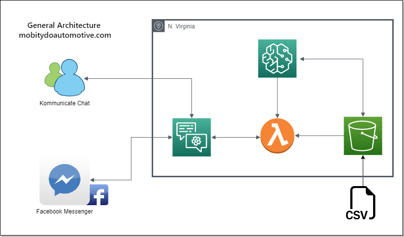

# www.mobitydoautomotive.com
## Project 2 : FINTECH Bootcamp UofT 2022

## Introduction 
...

## Architecture 
...

## Dataset and Resources
* Kaggle (main data source)
* Datahub
* Data.Gov
#### Resources used
* AWS - Lambda and Sagemaker
* Scikit-Learn ML linear regression used

## Files
* [Lex Bot](/Lex/)
* [Lambda function](/Lambda/)
* [SageMaker](/SageMaker/)
* [Lambda added layers](/Lambda_added_layers/)
* [Resources](/Resources/)
* [Presentation](/Presentation/Project%20Presentation%20-%20Project%202.pdf) 

